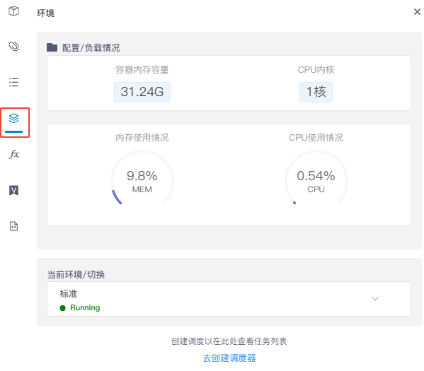
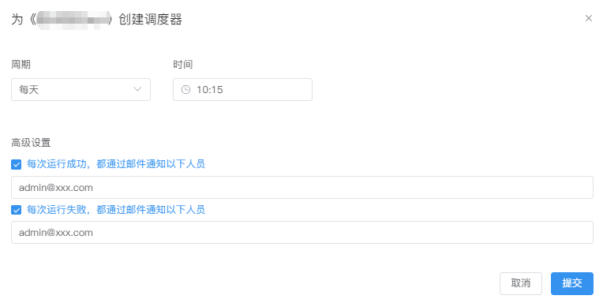
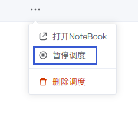
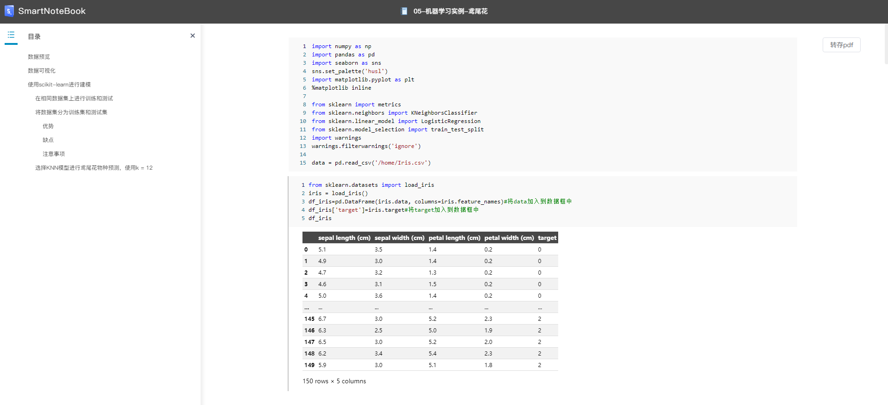

# 调度器
---
<!-- 是什么 -->

设定调度器会安排NoteBook按计划（如每小时/天/周/月）间隔重复运行。

注意以下几点：

- 在创建调度器时，需保证此NoteBook至少已经保存了一个版本(如未保存版本，SNB会将当前内容自动保存一个版本运行)
  
- 调度器执行时，将从上到下执行整个NoteBook的逻辑。如NoteBook中有单元格报错，会继续执行后面单元格的代码（当然，如果后面单元格的代码依赖前面报错的单元格结果，则后面的单元格也会报错）
  
- 当一个NoteBook拥有多个版本记录时，调度总是执行最新保存版本的代码。

> [!NOTE]
> 一个 NoteBook 在单个环境上只能配置一个调度器（计划），但如果您有多个环境，您可以在每个环境上为同一个 NoteBook 配置多个调度器（计划）。这样，您可以在不同的环境中灵活地管理和调度同一个 NoteBook 的执行。

## 创建调度

在NoteBook文档内，点击左侧侧边栏的`环境` 按钮。 

<!--    -->
  

点击最下方的`去创建调度器`

  

设置执行周期，可以安排每小时、每天、每周或每月定期执行。

  

在高级设置中，可以选择配置计划运行完成时状态成功或失败的通知，以及哪些用户将收到这些通知。

<!--    -->
  

**样例：**

设定`每天 10:15` 执行，无论执行成功或失败均通知管理员admin@xxx.com

  

## 立即执行调度

设定调度执行，如果想立刻查看调度的运用结果那么，你只用点击`立即执行`按钮。

  

## 查看历史

单击调度器列表中某条记录，可以查看该调度器执行的历史执行情况。

同时，在这个页面，你也可以查看、下载和删除历史运行结果。

如需调整调度设置可点击右侧的`调度器设置`来重设执行计划。

  

## 打开NoteBook

快捷跳转打开调度器对应的NoteBook文档。

## 暂停/恢复调度

以下几种方式均可暂停/恢复调度

1.在NoteBook文档内，点击左侧侧边栏的`环境` 按钮，下方开关可暂停/恢复调度：

  

2.在WorkSpace下的调度器列表选择需要暂停的任务点击`...`后选择`暂停调度`，可以暂停调度：

  

3.在调度器运行历史的页面也可以通过开关快捷暂停/恢复调度：

  

## 运行结果

运行结果记录了NoteBook中代码运行结果和相关信息的文档。

点击调度器列表的某条记录，弹出该调度器的历史运行记录，在此我们可以查看、下载和删除历史运行结果。

  

### 查看运行结果

点击`查看运行结果`跳转至结果页面：

  

### 下载运行结果

将导出运行结果的.snb文件

  

### 删除运行结果

删除历史运行结果

> [!Warning]
> 删除的历史结果无法恢复，请谨慎操作！

## 删除调度

在WorkSpace下的调度器列表选择需要删除的调度，点击`...`后选点击`删除调度`。

> [!Warning]
> 删除调度前需确认任务是否正在执行，否则会提示删除失败。

## 切换查看不同环境下的调度器

<!--    -->
<!--    -->
  

## 调度器标识

配置调度器后的NoteBook名称右侧会增加圆点标识

<!--    -->
  

