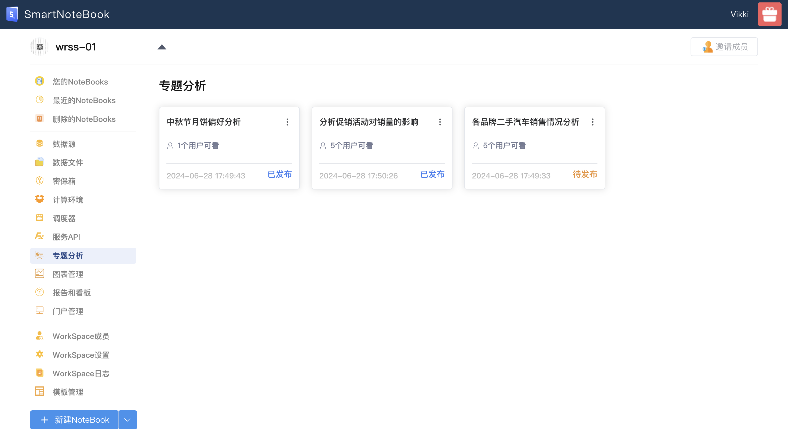
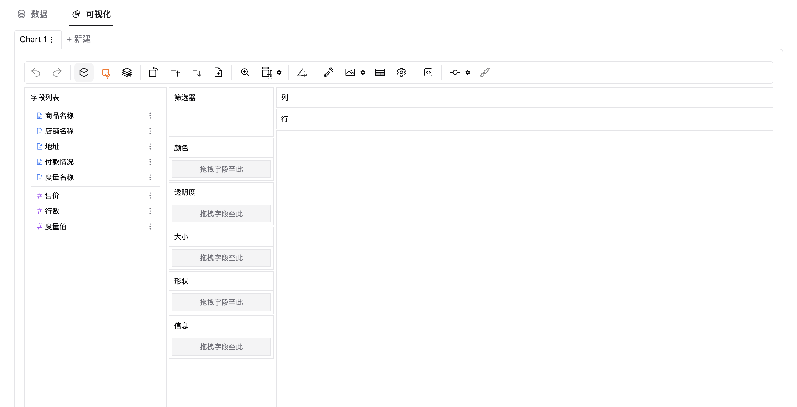
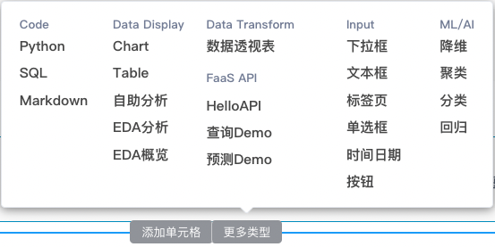
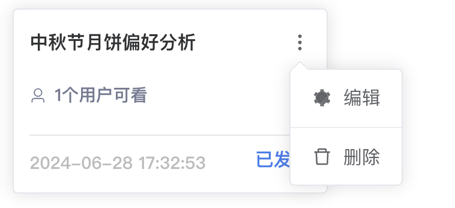
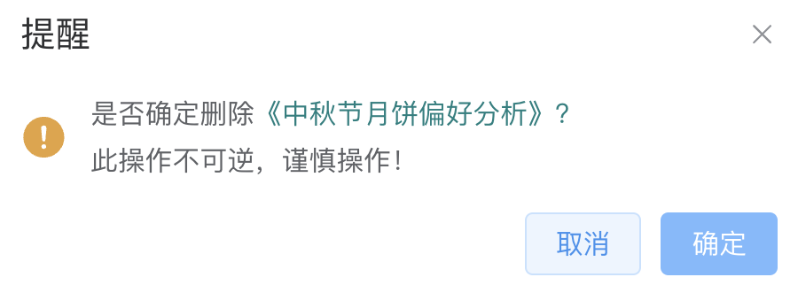

## 专题分析管理
### 查看

点击进入可以看到该专题的字段列表区域展示了你保存时要分析的数据集，可以在这里继续你的自助探索或分析。

### 创建
专题来源于自助分析组件，先添加一个“自助分析”组件，

接着选择事先准备的数据集，按需调整配置项，然后点击该组件单元格右边的保存专题图标，然后在弹出的对话框中输入专题名称,点击“提交”，即可保存该专题。

### 修改专题/配置权限
在专题列表中可以修改专题的名称和发布状态，也可以配置该专题分析的查看权限，规则是设置谁可以看，只有勾选过的用户才可以查看该专题。

**编辑**

**删除**
