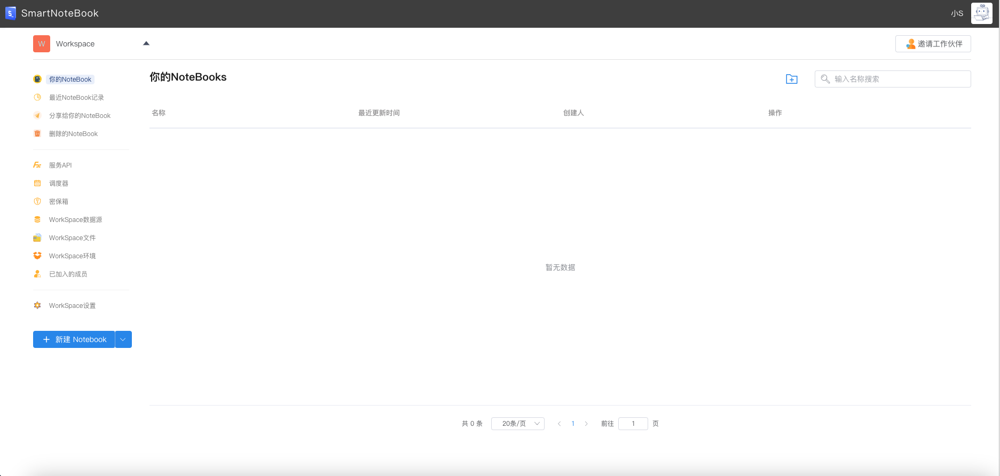
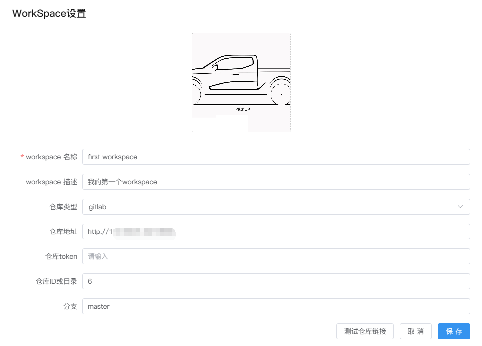
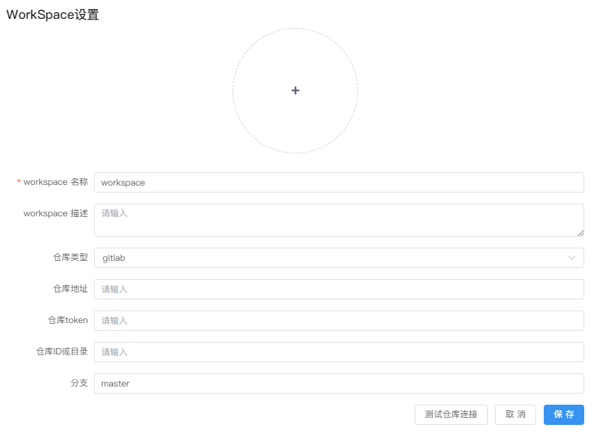
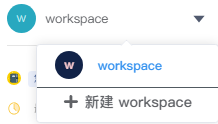
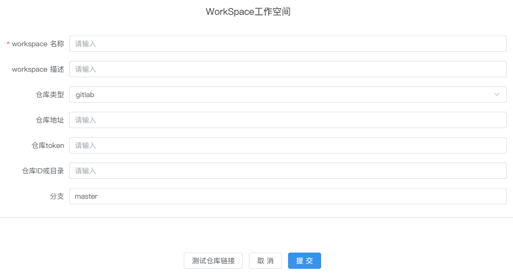
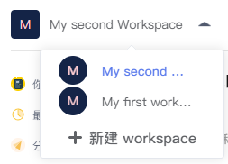

# WorkSpace（工作空间）
---

## 概述
<!-- 是什么 -->

WorkSpace（工作空间）是SNB的中央组织单位。它就像SNB的大管家，集合了团队成员在同一个组织内的各类资源要素，如NoteBook模型文件、数据资产、环境资源等等，帮助我们更好地组织和管理数据分析工作。

<!--    -->

  

<!-- 功能概览 -->

## 功能列表
| 功能 | 解释 | 
| :-----| :---- | 
| 您的NoteBooks | WorkSpace所有NoteBook模型文件列表。详见<a href="/WorkSpace/NotebookTable.md" title="您的NoteBooks">您的NoteBooks</a> | 
| 最近的NoteBooks | 本账号最近浏览NoteBook文件记录列表。详见<a href="/WorkSpace/RecentVisits.md" title="最近的NoteBooks">最近的NoteBooks</a> | 
| 删除的NoteBooks | 本登陆账号最近删除的Notebook文件记录列表（支持一键恢复）。详见<a href="/WorkSpace/RecentDel.md" title="删除的NoteBooks">删除的NoteBooks</a> | 
| 数据源 | 数据源的连接与管理。详见<a href="./DataSource.md" title="数据源">数据源</a> | 
| 数据文件 | 文件的上传与管理（上传到WorkSpace）。详见<a href="./Files.md" title="数据文件">数据文件</a> | 
| 密保箱 | 配置key-value全局变量或加密敏感信息。详见<a href="./Encryption.md" title="密保箱">密保箱</a> | 
| 计算环境 | NoteBook运行环境的配置与管理。详见<a href="./Environment.md" title="计算环境">计算环境</a> | 
| 调度器 | 用于设定并管理NoteBook模型文件的定期运行，查看运行结果。详见<a href="./Schedule.md" title="调度器">调度器</a> | 
| 服务API | 用于管理已注册的服务API、测试与使用服务API。详见<a href="./FassService.md" title="服务API">服务API</a> | 
| 专题分析 | 展示了你保存时要分析的数据集，可以在这里继续你的自助探索或分析。详见<a href="/WorkSpace/Subject.md" title="专题分析">专题分析</a> | 
| 图表管理 | 自助分析过程中保存的图表列表。详见<a href="/WorkSpace/ChartLib.md" title="图表管理">图表管理</a> | 
| 报告和看板 | 查看并管理已创建的数据报告与看板。详见<a href="./Dashboard.md" title="报告和看板">报告和看板</a> | 
| 门户管理 | 门户管理指的是管理一个系统的门户应用程序。门户是用户进入报表系统主要入口点， 提供了访问各种信息、服务和功能的统一界面。详见<a href="/WorkSpace/PortalTion.md" title="门户管理">门户管理</a> | 
| WorkSpace成员 | 成员管理。详见<a href="./Groups.md" title="成员">成员</a> | 
| WorkSpace设置 | 管理WorkSpace的相关配置。详见<a href="./Settings.md" title="设置">WorkSpace设置</a> | 
| WorkSpace日志 | WorkSpace日志管理，提供搜索，查询。详见<a href="/WorkSpace/Logging.md" title="设置">WorkSpace日志</a> | 
| 模板管理 | 模版管理为了高效构建仪表盘，我们提供快捷的建立，编辑，和管理模版的功能。详见<a href="/WorkSpace/DashboardTemplates.md" title="模版管理">模版管理</a> | 

<!-- 操作类型 -->

## 相关操作

用户成功登录SNB后，会进入到系统默认的`WorkSpace`工作空间。

###  修改Workspace信息

点击`WorkSpace设置`，进入WorkSpace的设置界面，然后点击`编辑`按钮。

<!--    -->
  

在这里您可以修改您自己的WorkSpace名称与描述，配置代码仓库（配置方式详见<a href="./Settings.md/#git" title="Workspace设置">WorkSpace设置</a> ），并上传您喜欢的头像。一切配置完成后记得点击`保存`。

| 功能 | 解释 | 
| :-----| :---- | 
| WorkSpace 名称 | 名称，必填项 | 
| WorkSpace 描述 | 描述，选填项 | 
| 仓库类型 | 选填配置， 目前支持的仓库类型：gitlab 和 github| 
| 仓库地址 | 配置git仓库的url，格式如：`http://172.30.81.xxx:8000`| 
| 仓库token | 配置git仓库的Access Token | 
| 仓库ID或目录 | 配置git仓库的ID或目录 | 
| 分支 | 配置git仓库的分支 | 
| 头像 | 单击上方`＋`上传新的头像 | 
| 测试仓库链接（按钮） | git仓库配置完成后，点击测试是否成功 |

### 创建新的WorkSpace

单击左上角WorkSpace的下拉箭头，点击`新建WorkSpace`

<!--    -->

  

然后输入新的WorkSpace的相关信息和配置，点击`提交`，新的WorkSpace创建完成。

  

### 切换WorkSpace

当用户拥有或加入了多个WorkSpace时，如需切换，可点击左上小三角切换至需要的WorkSpace。

  
