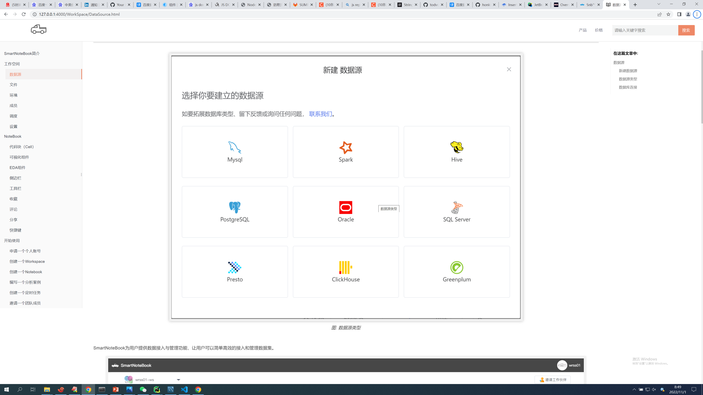
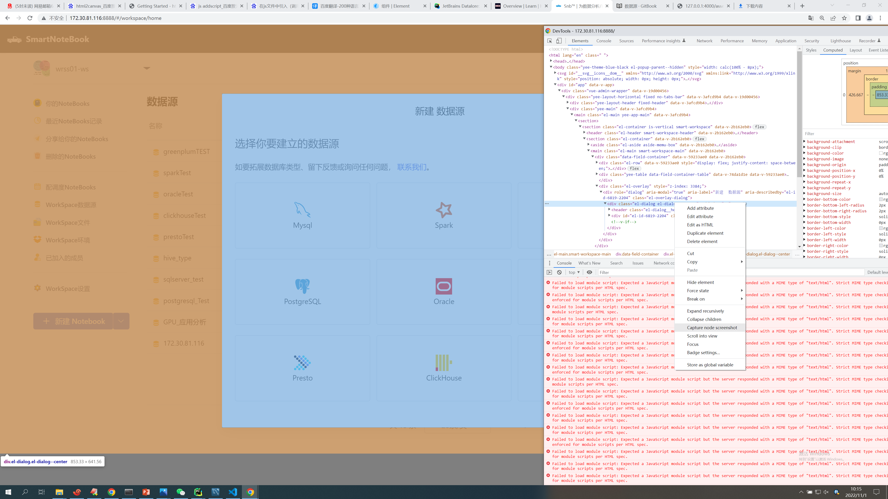
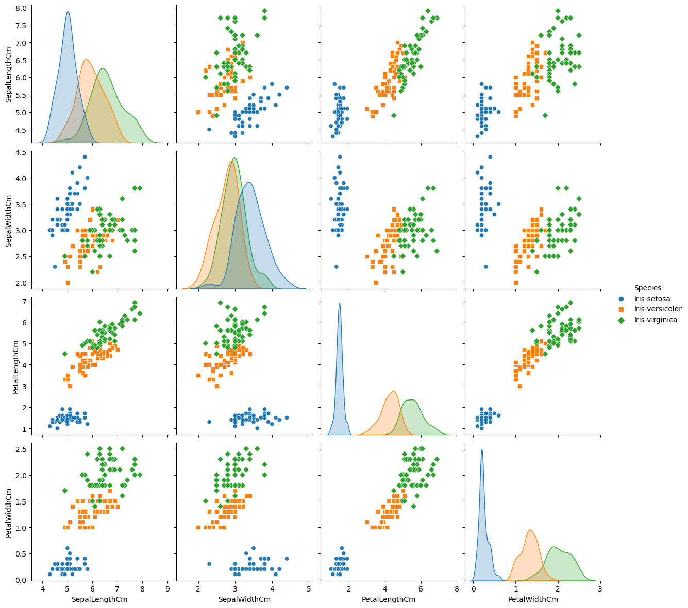

##  
gitbook.cmd install
npm run serve

## 关于图片增加图标题题(fig caption)和style


- 引入插件image-captions  ，参见book.json

- 修改 插件的index.js 代码
  - ode_modules\gitbook-plugin-image-captions\src\index.js
  - 76 行 function setImageCaption ($, img, data)  函数内添加下面代码

```js

var alt_split = data.alt.split("style=")
  if ( alt_split.length>1 ){
    data.alt=alt_split[0];
    img.attr('alt',alt_split[0]);
    img.attr('style',alt_split[1].replace(/"/g,''));
  }

```

- markdown img 的格式说明
  -  alt 添加style 样式  [支持的数据源类型 style="width: 70%;height: 70%;"]
  -  添加title 标题
-  样例
   -  
```

```

### img 标签后不能有空格


  


## 关于局部截图 
- 局部截图使用chrome dev tools: capture node screenshot
  - F12 打开dev tools
  - 选定元素 ，右键菜单：capture node screenshot


  


## 注意提醒(alert、note、tips、attention、warning)
https://github.com/fzankl/gitbook-plugin-flexible-alerts

> [!NOTE]
> An alert of type 'note' using global style 'callout'.


> [!Tip]
> 在分析过程中，Notebook会将我们写的Markdown标题按照层级显示为大纲目录，增加整个分析过程的可读性。另外，我们也可以通过点击大纲目录中的小节快速定位到代码块。所以，养成良好的数据分析报告书写习惯不仅提升数据分析师的效率，同时也会提高阅读者的阅读体验。

## sdd

> [!NOTE|style:flat]
> An alert of type 'note' using alert specific style 'flat' which overrides global style 'callout'.


## sdd

> [!warning|style:flat]
> An alert of type 'note' using alert specific style 'flat' which overrides global style 'callout'.


## 小图标的样式

<p>单击密保名称前面的可以复制密保的使用代码，并在NoteBook中插入代码进行调用。</p>


## 详见链接样式
详见<a href="./WorkSpace/Files.md" title="设置">设置</a>

## 外部网站引用
[SQLite3 Documentation](https://www.sqlite.org/docs.html)。

## 内部跳转位置
见[代码自动补全](#show) 
<span id="show"></span>

## 外部跳转文档的固定位置
<a href="./Sidebar.md/#sv" title="保存版本">版本列表</a> 
<span id="sv"></span>


## 设置图片大小



## 反馈邮箱
<feedback@smartnotebook.tech>
[XXX](feedback@smartnotebook.tech)


- repeat：重复方式
  - "Watermark" - 水印
  - "Repeat" - 重复
  - "Repeat-X" - 横向重复
  - "Repeat-Y" - 纵向重复
  - "Space" - 间隔重复
  - flipXY

- position：图片位置
  - center：居中
  - left：靠左
  - right：靠右
  - top：顶部
  - bottom：底部

- size：图片大小
  - auto：自动
  - cover：覆盖
  - contain：适应
  - 100%：拉伸？？
  - xxx：是啥？？

- opacity：透明度